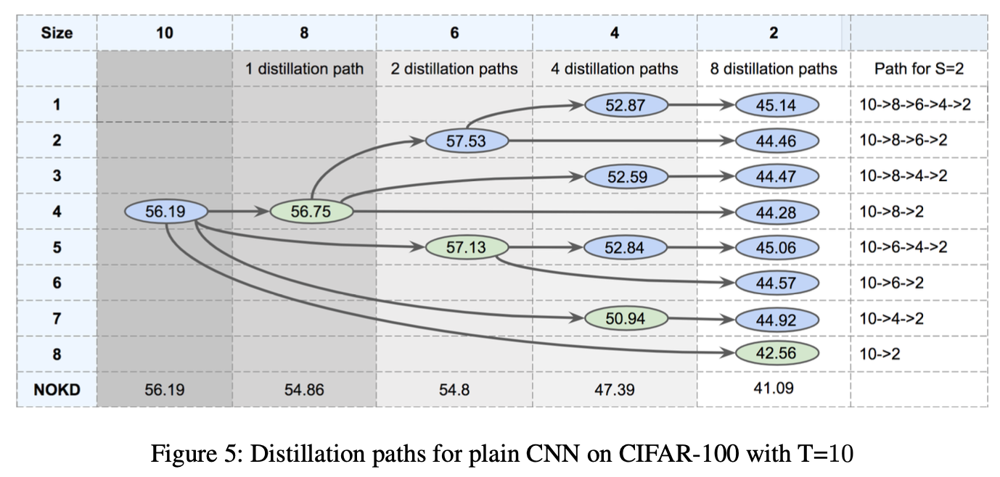
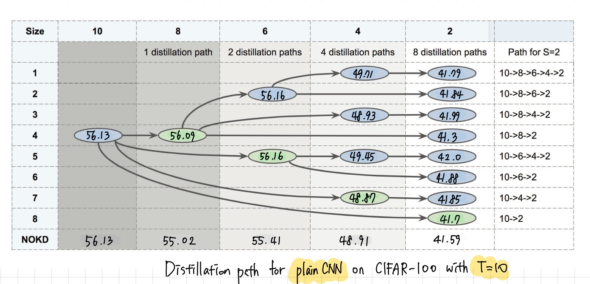
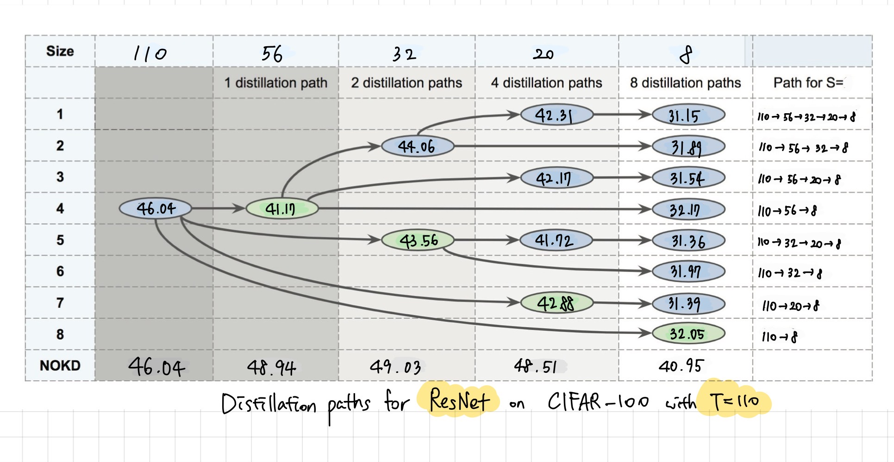

# CNN-TA-Distillation


## 0. Project Overview
### Brief introduction of the baseline paper
This project is an replication of TAKD (Teacher Assistant Knowledge Distillation) framework. One of the most critical challenges in knowledge distillation from a teacher model to a student model is performance degradation due to the limited number of parameters in the student model. To address this, the TAKD approach introduces to use intermediate Teacher Assistant (TA) model, which has fewer parameters than the teacher but more than the student. By using the TA model as a bridge, TAKD performs multi-stage distillation, which helps transfer knowledge more effectively and mitigates the capacity gap between teacher and student models.

### Modification of the evaluations from the baseline paper
Originally, TAKD mostly evaluated the performance of using TA model based on the `CNN model` for the distillation path. **(Important) In this project, I repliacted the process of distilling knowledges not only `CNN model`, but additionally `ResNet` model, with CIFAR-100 dataset to choose the best size of TA, which is addressed as a crucial issue by the authors.** The best size of TA can be found by evaliating all the possible distillation paths within the range of model sizes between teacher model and student model. I followed the model sizes introduced in the paper, which are 110 for teacher model, and 8 for student model. Intermediate TAs are set with 56, 32, and 20 which are being reduced into around half size of the teacher models.

## 1. Environmental Setup
1. Connect to the server with GPUs.
We will use [DRAC](https://alliancecan.ca/en/search?keywords=ssh) (Digital Alliance Canada Cluster) to run this experiment. Create your account, and connect to server with ssh to use GPU by following the instruction of the website.
2. Create your own virtual environment in the server.
```
module load python/3.10
virtualenv --no-download {ENV_NAME}
source ~/{ENV_NAME}/bin/activate # ✅ TODO everyday: Always activate this env whenever you use the server!!
pip install --no-index --upgrade pip
```
3. Request GPUs with the following command.
```
srun -c {NUM_CPUs} --gres=gpu:{GPU_NAME}:{NUM_GPUs} --mem={SIZE_MEM} --pty --time={REQUEST_TIME}:00:00 bash
```
for example,
```
srun -c 4 --gres=gpu:v100l:1 --mem=16GB --pty --time=3:00:00 bash
```
4. Clone this repository in your own path.
```
git clone https://github.com/GAEUNYIM/CNN-TA-Distillation.git
```
5. Download CIFAR dataset from the google drive [link](https://drive.google.com/drive/folders/1mUncKdoadQGLvQopjCbAc8byEWtvlx2t?usp=sharing).
6. Copy CIFAR dataset into the `data` directory in your repository.
```
cd CNN-TA-Distillation
mkdir data
cp cifar-100-python/ data
```

## 2. Train and Evaluate the Model
1. First step is to train the biggest Teacher model from the CIFAR dataset with the following command. At this step, the original teacher model will be a student model of the ResNet.
```
python3 train.py --epochs {NUM_EPOCHS} --student {MODEL_NAME}{S_SIZE} --cuda {NUM_GPUS} --dataset cifar100
```

2. Distill knowledege from the Teacher to the Students with CIFAR dataset, by editting the following user parameters. You can distill knowledge by chaning students model in sequences.
```
python3 train.py --epochs {NUM_EPOCHS} --teacher {MODEL_NAME}{T_SIZE} --teacher-checkpoint {T_CKPT_PATH} --student resnet{S_SIZE} --cuda {NUM_GPUS} --dataset cifar100
```
- NUM_EPOCHS: Number of epochs for training; recommend `20`
- MODEL_NAME : Model name for CNN or ResNet; `plain` or `resnet`
- T_CKPT_PATH: Path for teacher model
- T_SIZE: Size of teacher model
- S_SIZE: Size of student model
- NUM_GPUS: Number of GPUs to use; recommend `1` 

for example,
```
python3 train.py --epochs 20 --student plain10 --cuda 1 --dataset cifar100
```
```
python3 train.py --epochs 20 --teacher plain10 --teacher-checkpoint ./cnn10.pth.tar --student plain2 --cuda 1 --dataset cifar100
```
3. Check whether the checkpoints, and the evaluation results are created.
```
├── train.py
├── models/
│
├── checkpoints/
│   │
│   ├── resnet110_56.pth.tar
│   ...
│   │
│   └── resnet110_56_32_20_8.pth.tar
│
└── evaluations/
    │
    ├── resnet110_56.txt
    ...
    │
    └── resnet110_56_32_20_8.txt
```
(Note) In this project, we should try 16 experiments in total for the each `Plane CNN`, and `ResNet` set. Why 16 experiments are needed for each set? Here are the reasons.
- The biggest size of the teacher model was `10`.
- The other candidates of the student models were `8`, `6`, `4`, and `2`. 
- Since we have 4 possible sizes of student model, there should be 2 to the power of 4 (=16) experiments to test all the cases.
- Possible candidate sizes for `CNN` are: `10`, `8`, `6`, `4`, and `2`.
- Possible candidate sizes for `ResNet` are: `110`, `56`, `32`, `20`, and `8`.

## 3. Results 
Here are the results table contains the model accuracy for all possible distillation paths. 
1. (CNN) Results from the original paper.


2. (CNN) Results from the replication with same condition.


3. (ResNet) Results from the replication with different hyperparameters condition.



## 4. Analysis